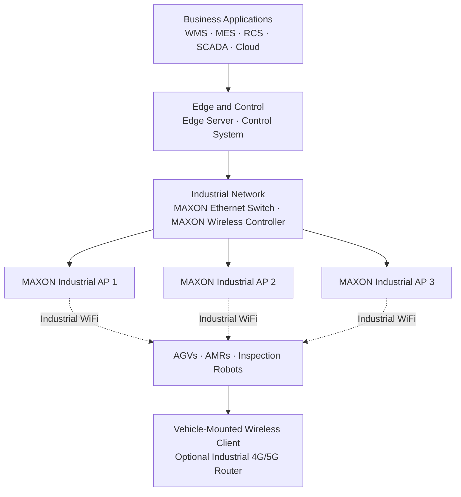
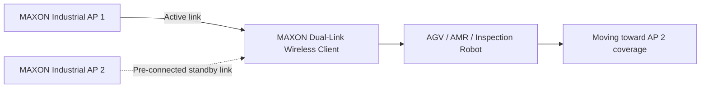
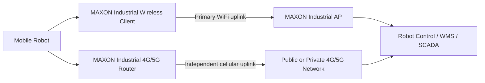

# AGV Wireless Communication: Industrial WiFi for AMRs and Inspection Robots

AGV wireless communication is the network connection that carries dispatch commands, status reports, telemetry, video, and maintenance data between an automated guided vehicle and plant systems. A reliable design requires more than WiFi coverage: it must also manage movement between access points, radio interference, vehicle-mounted antennas, and loss of an upstream path.

> **About MAXON:** [MAXON](https://www.mxcomm.cn/) develops industrial wireless communication products for factory automation, warehouses, mobile robots, transportation, oil and gas, energy, and other industrial environments. Explore the [MAXON industrial wireless product portfolio](https://www.mxcomm.cn/products/industrial-wireless.html).

**Primary topic:** AGV wireless communication  
**Also covers:** AGV WiFi roaming, AMR wireless connectivity, industrial WiFi access points, industrial wireless clients, and WiFi/5G backup  
**Updated:** August 5, 2026

## Contents

- [Why AGV wireless communication fails](#why-agv-wireless-communication-fails-in-factories-and-warehouses)
- [Five-layer network architecture](#five-layer-industrial-wireless-architecture-for-agvs-and-amrs)
- [AGV WiFi roaming options](#agv-wifi-roaming-and-amr-wireless-connectivity-options)
- [How MAXON products work together](#how-maxon-products-work-together)
- [Network design and commissioning](#how-to-design-and-commission-the-network)
- [Applications](#where-this-architecture-is-used)
- [Safety and cybersecurity](#safety-and-cybersecurity-boundaries)
- [Frequently asked questions](#frequently-asked-questions)

## Why AGV Wireless Communication Fails in Factories and Warehouses

A stationary sensor may tolerate a short reconnection or delayed packet. A moving robot often cannot. Its wireless connection may carry a heartbeat to the robot control system, task updates from a warehouse management system, live inspection video, and diagnostic data for maintenance. These flows have different bandwidth and latency requirements, but they share the same radio environment.

Factories and warehouses are difficult RF spaces. Steel racks, machinery, vehicles, inventory, and partitions create reflection and shadowing. Motors, variable-frequency drives, and other radio systems can add noise. The client antenna also moves close to metal structures and people, changing its effective radiation pattern.

Roaming adds another challenge. An AGV may remain connected to a weak access point after entering the coverage area of a stronger one. Authentication and key exchange may extend the interruption if the client and infrastructure are not configured for mobility. The result can be a paused robot, lost video, or a missed dispatch update near an AP cell boundary.

AGV WiFi roaming is only one part of the problem. Industrial wireless design should start with application traffic, route conditions, and failure behavior rather than with a simple access-point count.

## Five-Layer Industrial Wireless Architecture for AGVs and AMRs

The following reference architecture separates business applications, control, wired infrastructure, radio access, and robot-mounted equipment. This structure makes network expansion and fault isolation easier.

### 1. Business application layer

The business layer can include a warehouse management system (WMS), manufacturing execution system (MES), robot control system (RCS), SCADA platform, and cloud monitoring service. These systems assign tasks, receive production data, and display fleet status.

### 2. Edge and control layer

Edge servers and control systems process local data and keep important decisions close to the production floor. Local processing can reduce dependence on a remote cloud connection, but it does not remove the need for a stable path between robots and the control network.

### 3. Industrial network layer

The wired backbone connects edge systems, industrial Ethernet switches, and the wireless controller. Centralized AP management keeps SSID, security, radio, and roaming policies consistent. VLAN and quality-of-service policies can separate robot control, video, maintenance, and general IT traffic.

### 4. Wireless access layer

Multiple [MAXON industrial wireless access points](https://www.mxcomm.cn/products/industrial-wireless/industrial-wireless-access-point.html) create overlapping radio cells along robot routes. The objective is controlled overlap, not maximum transmit power. Excessive power can increase co-channel interference and encourage clients to remain associated with a distant AP.

AP placement, antenna type, channel plan, and mounting height should be based on an on-site RF survey.

### 5. Mobile robot layer

Each AGV, AMR, or inspection robot connects through a vehicle-mounted industrial wireless client. The client bridges Ethernet equipment on the robot to the plant WLAN. An [industrial 4G/5G router](https://www.mxcomm.cn/products/industrial-wireless/industrial-4g-5g-router.html) can add a cellular path for backup connectivity, outdoor routes, or independent remote access.

The cellular router is a separate device with a different upstream network. It should not be described as a second WiFi association.

## AGV WiFi Roaming and AMR Wireless Connectivity Options

No single topology fits every mobile robot project. The following designs address different failure modes.

### Standard AGV WiFi roaming

In a standard design, one vehicle-mounted client communicates through one AP at a time. As the robot moves, the client selects a new AP and changes association.

IEEE 802.11k, 802.11v, and 802.11r can assist neighbor discovery, network steering, and fast BSS transition when the infrastructure and client both support the required functions. These standards do not guarantee a fixed handover time by themselves. The result also depends on:

- Authentication mode
- Client and AP firmware
- Scan behavior and roaming thresholds
- RF overlap and channel planning
- Traffic load
- Application recovery behavior

Measure interruption time, packet loss, and application recovery on the complete system before accepting the design.

### Pre-connected dual-link WiFi roaming

A dual-link wireless client can maintain an active communication path while preparing a second path to a candidate AP, when this behavior is supported by the selected hardware, firmware, security mode, and configuration.

When the robot crosses a coverage boundary, the prepared path can reduce the connection work required at the transition. This design does not remove the need for good RF engineering. Both links can still be affected by poor antenna placement, common interference, inadequate overlap, or a wired-network fault upstream of the APs.

Use this option when time-sensitive control traffic, inspection video, or other applications fail the acceptance criteria with ordinary single-link roaming. Validate the design under motion and representative network load.

Learn more about the [MAXON AGV roaming solution](https://www.mxcomm.cn/solution/3965.html) and [vehicle wireless communication products](https://www.mxcomm.cn/products/industrial-wireless/vehicle-wireless.html).

### WiFi and 4G/5G dual-uplink connectivity

WiFi and cellular connectivity address a different failure mode. The vehicle-mounted wireless client connects to the plant WiFi network, while the industrial 4G/5G router connects through a public or private cellular network.

A routing policy and health-check mechanism select the preferred path and change to the backup when defined conditions fail. Installing two radios does not automatically provide bonding or failover.

The project must define:

- Health-check destination
- Failure threshold
- Recovery timer
- Return-to-primary behavior
- VPN and security policy
- Application response to IP address or path changes

Stateful sessions, VPN tunnels, application timeouts, and common points of failure must be tested.

## How MAXON Products Work Together

The equipment should operate as one network rather than as isolated products.

| MAXON product or component | Role in the robot network | Key engineering questions |
|---|---|---|
| [Industrial wireless access point](https://www.mxcomm.cn/products/industrial-wireless/industrial-wireless-access-point.html) | Provides WiFi coverage along production and inspection routes | Which band, channel width, antenna pattern, mounting position, and overlap fit the site? |
| [Vehicle wireless communication products](https://www.mxcomm.cn/products/industrial-wireless/vehicle-wireless.html) | Connect robot-mounted Ethernet equipment to the wireless infrastructure | Which client mode, firmware, security configuration, and roaming behavior are required? |
| [Industrial 4G/5G router](https://www.mxcomm.cn/products/industrial-wireless/industrial-4g-5g-router.html) | Provides cellular WAN access for backup, outdoor routes, or independent management | Public or private 5G? Which bands, SIM, VPN, routing, and failover policies are required? |
| Industrial Ethernet switch | Aggregates APs, controllers, servers, and other wired equipment | Are PoE, VLANs, fiber uplinks, redundancy, or additional ports required? |
| Wireless controller | Centralizes AP configuration and radio management | How many APs, which roaming policies, and what monitoring data are required? |

The exact product model must be selected from confirmed project requirements. Wireless standard, frequency, interfaces, power input, antenna connectors, environmental protection, and operating temperature should be checked against the current MAXON datasheet before quotation.

## How to Design and Commission the Network

### Define application traffic before selecting hardware

List every flow to and from the robot. Record normal and peak throughput, packet direction, maximum acceptable interruption, and recovery behavior. A dispatch heartbeat, a high-resolution inspection stream, and a maintenance download should not automatically receive the same priority.

Identify which traffic must continue during a WiFi outage. Some projects need cellular backup only for remote diagnostics. Others may need the RCS connection or a video tunnel to remain available.

### Survey the complete robot route

Measure signal strength, noise, channel use, and interference at the robot antenna height. Include turns, elevators, charging points, narrow aisles, metal racks, and areas where people or vehicles can obstruct the path.

A handheld survey device at human height does not reproduce an antenna installed inside or close to a metal robot chassis.

### Design overlap and capacity together

Adjacent cells need enough overlap for the client to find and prepare the next connection, but more overlap is not always better. Reusing the same channel too closely can reduce capacity. Wide channels may increase throughput in a clean environment, but they consume more spectrum and are harder to reuse in a dense factory.

Plan for peak fleet operation. Include video bursts, software updates, broadcast or multicast behavior, and the possibility that multiple robots enter one cell at the same time.

### Treat antennas as part of the radio system

A capable wireless client can perform poorly if its antennas are installed behind a battery enclosure or close to a large metal surface. Keep antennas clear of shielding structures, follow the required spacing and polarization guidance, and avoid unnecessary cable loss.

For dual-link or cellular designs, position antennas according to the equipment instructions and available mounting space.

### Test movement, failure, and recovery

Acceptance testing should reproduce the robot route and application load. Record at least:

- Round-trip latency, jitter, and packet loss during movement
- Interruption time at every AP transition
- RCS, WMS, SCADA, and video-session behavior
- Response to an AP, switch port, or upstream failure
- Cellular failover and return to the preferred path
- Performance with the planned number of active robots
- Logs from the client, AP, controller, switch, and router

A pass/fail threshold should come from the application owner. Terms such as “fast roaming,” “seamless roaming,” and “uninterrupted” are not acceptance criteria unless they are tied to measured limits.

## Where This Architecture Is Used

The same network pattern can support several mobile machine types:

- AGVs carrying materials through factories and warehouses
- AMRs used for flexible intralogistics and order fulfillment
- Wheeled inspection robots carrying visible-light, thermal, acoustic, or gas sensors
- Robot dogs operating on stairs, narrow corridors, or uneven terrain
- Outdoor mobile equipment moving between plant WiFi and cellular coverage

The International Federation of Robotics identifies transportation and logistics as the largest professional service robot application group.[^1] The 5G Alliance for Connected Industries and Automation also lists mobile robots and AGVs among industrial applications that depend on wireless communication because a wired connection is not practical for a moving platform.[^2]

## Safety and Cybersecurity Boundaries

The communication network supports robot operation, but it should not be presented as the robot's only safety mechanism. ISO 3691-4:2023 specifies safety requirements and verification for driverless industrial trucks and their systems, including AGVs and AMRs.[^3]

The machine builder, system integrator, and site operator remain responsible for the complete safety design and risk assessment. Define the safe state for a communication loss and test emergency behavior independently from roaming performance claims.

For cybersecurity:

- Use supported authentication and encryption
- Change default credentials
- Restrict management access
- Segment operational technology traffic
- Log configuration changes
- Use an approved private APN, VPN, or equivalent control for cellular access

The selected controls must match the customer's OT security policy.

## Why Work with MAXON?

[MAXON](https://www.mxcomm.cn/) provides industrial wireless products for both the infrastructure and vehicle sides of a mobile robot connection. The portfolio includes industrial wireless access points, vehicle-mounted wireless clients, industrial 4G/5G routers, wireless controllers, industrial Ethernet switches, wireless bridges, and industrial WiFi modules.

This allows a project team to evaluate AP coverage, AGV WiFi roaming, AMR wireless connectivity, and upstream resilience as one system.

To discuss a project, provide:

- Facility layout and robot route
- Robot type and fleet size
- Indoor or outdoor operating environment
- Application traffic and bandwidth requirements
- Available power and Ethernet interfaces
- Antenna installation constraints
- Roaming or recovery target
- Cellular network preference
- Environmental protection requirements

Visit the [MAXON official website](https://www.mxcomm.cn/) or contact [info@maxonc.com](mailto:info@maxonc.com).

## Frequently Asked Questions

### What is the difference between an industrial AP and a wireless client on an AGV?

The industrial AP creates the wireless infrastructure cell. The vehicle-mounted client connects the AGV's Ethernet equipment to that cell. The AP is normally fixed to a wall, column, or other structure, while the client moves with the robot. Both sides influence roaming performance.

### Does IEEE 802.11r guarantee zero packet loss during roaming?

No. IEEE 802.11r can reduce authentication work during a transition, but packet loss and interruption also depend on RF coverage, scanning behavior, firmware, security, traffic load, and application behavior.

### Does seamless roaming WiFi mean zero interruption?

No. “Seamless roaming WiFi” is a common search and marketing phrase, not a universal engineering guarantee. Define a measurable acceptance limit and test the complete AP-client system on the actual robot route.

### How does a dual-link wireless client differ from ordinary roaming?

An ordinary client normally uses one AP association and changes to another when roaming is triggered. A dual-link design can maintain the current path while preparing a second AP path on supported hardware and firmware. The result must be validated with the selected AP, client, security mode, and application.

### Can WiFi and 5G operate at the same time on a robot?

Yes, when separate WiFi client and cellular router paths are installed and the routing policy is configured to use them. They may carry different traffic or operate as preferred and backup paths. Two installed radios do not automatically provide bonding or failover.

### How many industrial APs does an AGV or AMR project need?

There is no reliable AP-per-square-meter rule. The number depends on the building, rack layout, antenna pattern, mounting height, available channels, client antenna position, traffic load, and required overlap. Use an RF survey and validate the design while robots are moving.

## MAXON Product and Solution Links

- [MAXON Official Website](https://www.mxcomm.cn/)
- [Industrial Wireless Product Portfolio](https://www.mxcomm.cn/products/industrial-wireless.html)
- [Industrial Wireless Access Points](https://www.mxcomm.cn/products/industrial-wireless/industrial-wireless-access-point.html)
- [Industrial 4G/5G Routers](https://www.mxcomm.cn/products/industrial-wireless/industrial-4g-5g-router.html)
- [Vehicle Wireless Communication Products](https://www.mxcomm.cn/products/industrial-wireless/vehicle-wireless.html)
- [AGV Roaming Solution](https://www.mxcomm.cn/solution/3965.html)

## References

[^1]: International Federation of Robotics, [World Robotics 2025](https://ifr.org/worldrobotics/report-2025), including 2024 professional service robot sales for transportation and logistics.
[^2]: 5G Alliance for Connected Industries and Automation, [Key 5G Use Cases and Requirements](https://archive.5g-acia.org/fileadmin/5G-ACIA/Publikationen/5G-ACIA_White_Paper_Key_5G_Use_Cases_and_Requirements/Key_5G_Use_Cases_and_Requirements_DOWNLOAD.pdf), section on mobile robots and AGVs.
[^3]: International Organization for Standardization, [ISO 3691-4:2023, Industrial trucks — Safety requirements and verification — Part 4](https://www.iso.org/standard/83545.html).

---

Copyright © MAXON (Nanjing Maxon O.E. Tech Co., Ltd.). This article is provided for technical reference. Final product selection and network performance should be verified against current product documentation and project-specific test requirements.
